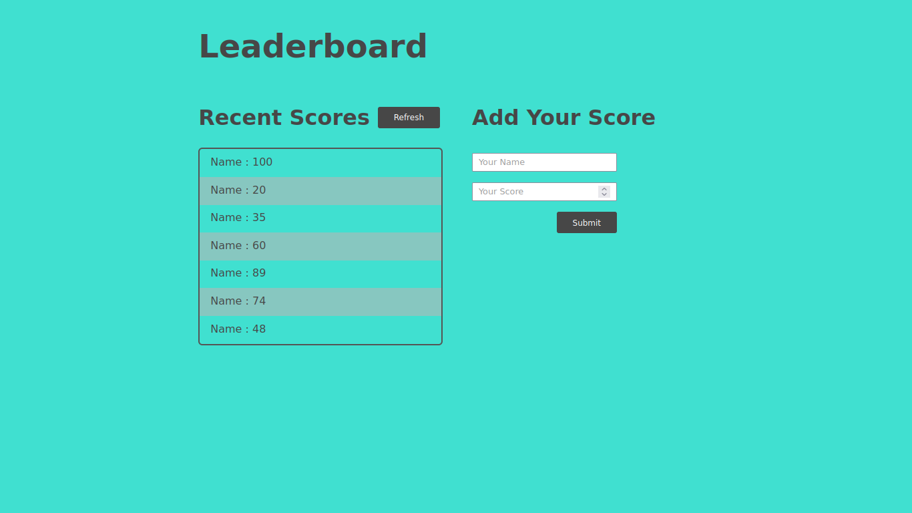

# leaderboard

The leaderboard website displays scores submitted by different players. It also allows you to submit your score. All data is preserved thanks to the external Leaderboard API service.




The leaderboard website displays scores submitted by different players. It also allows you to submit your score. All data is preserved thanks to the external [Leaderboard API service](https://www.notion.so/microverse/Leaderboard-API-service-24c0c3c116974ac49488d4eb0267ade3).

# Built With

- Javascript
- HTML
- CSS
- WEBPACK
# Getting started

## To get a local copy of this repository kindly follow the steps below.
- Scroll to top of this current repository
- Click on the `Code` button with background color green on the right end corner
- Click on the clipboard icon on the extreme right of the dropdown to copy the repository link
- In your local PC, open your terminal or command prompt in the folder you would like to clone this repository into
- Type `git clone (copied link)` on the currently opened terminal or command prompt
- Remember to change `(copied link)` to `https://github.com/TSHEPO-CLOUD/leaderboard/tree/final-touches` which is the name of the repositor

### Install

```bash
npm install
```

### Usage

```bash
npm start
```

### Build

```bash
npm run build
```

## Contributors

👤 **TSHEPO DAVID MOLEFE**

- [GitHub](https://github.com/TSHEPO-CLOUD)
- [Twitter](https://twitter.com/tshepomolefem)
- [LinkedIn](https://www.linkedin.com/in/tshepo-molefe-8153313b)


## 🤝 Contributing

Contributions, issues and feature requests are welcome!

Feel free to check the [issues page.](https://github.com/TSHEPO-CLOUD/leaderboard/issues/2)


## Acknowledgments

- Microverse
- [Leaderboard API Service](https://www.notion.so/microverse/Leaderboard-API-service-24c0c3c116974ac49488d4eb0267ade3)

## 📝 License

This project is [MIT](./MIT.md) licensed.
## Show your support

Give a ⭐️ if you like this project!

